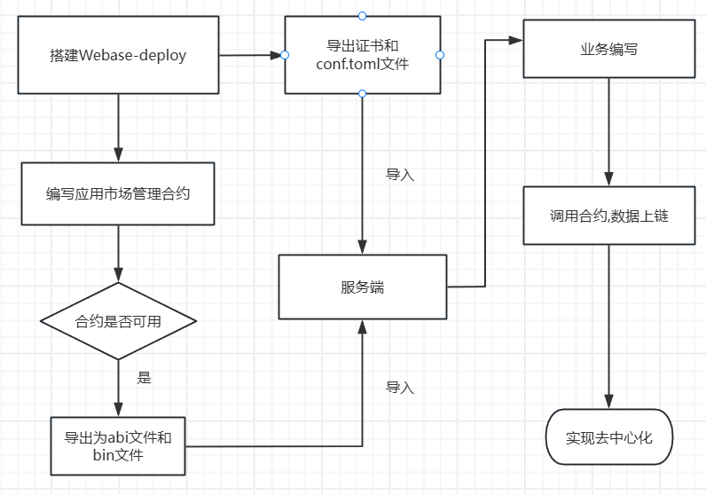

***\*氢信 SaaS 去中心化应用市场\****

 

**基于 FISCO BCOS 实现的去中心化应用市场解决方案**

 

***\*一、概述\****

 

氢信 SaaS 去中心化应用管理市场采用 ***\*FISCO BCOS\**** 区块链技术，旨在解决传统中心化应用管理中的数据安全、交易透明和信任问题。项目通过智能合约实现自动化的应用发布、价格控制和生命周期管理。系统模块化设计涵盖六大核心模块，以提高系统的透明性、安全性与运营效率。

 

***\*二、项目背景与目标\****

 

***\*背景\****

 

随着 SaaS 平台的普及，应用和服务的管理变得愈发复杂，传统中心化系统面临着以下挑战：

 

​	1.	***\*数据篡改与安全隐患\****：中心化数据库容易被恶意攻击或数据篡改。

​	2.	***\*交易不透明\****：用户与开发者难以审计和验证交易流程。

​	3.	***\*系统扩展性不足\****：传统架构难以应对市场多变的需求。

 

***\*项目目标\****

 

​	•	***\*去中心化管理\****：通过智能合约实现应用和交易的自动化执行，减少人为干预。

​	•	***\*安全透明\****：所有交易数据上链，确保公开可查且不可篡改。

​	•	***\*提升市场信任\****：为用户和开发者提供可靠、公正的交易环境。

 

***\*三、技术架构与选型\****

 

***\*核心技术组件\****

 

***\*组件\****	***\*用途\****	***\*版本\****

***\*JDK\****	Java 开发工具包	1.8_202

***\*Spring Boot\****	应用开发框架	3.3.4

***\*FISCO BCOS\****	区块链底层平台	最新版

***\*Webase-deploy\****	区块链应用平台	1.5.4

***\*MyBatis Plus\****	数据持久化增强工具	3.5.7

***\*Redis\****	缓存服务	>=5.0

***\*Flowable\****	工作流引擎	6.8.0

***\*Qiankun\****	微前端框架	支持 Vue 和 React

 

***\*架构设计\****

 

​	•	***\*微服务架构\****：基于 Spring Cloud 进行模块拆分，提高系统扩展性和解耦性。

​	•	***\*区块链与智能合约\****：使用 FISCO BCOS 管理所有交易和应用流程。

​	•	***\*微前端架构\****：通过 Qiankun 实现 Vue2、Vue3 和 React 模块的无缝集成。

 

***\*四、核心模块设计\****

 

***\*1. 应用市场管理\****

 

负责应用的上架、审核、更新和下架。

 

​	•	***\*智能合约\****：QuakeAppMarket.sol

​	•	***\*API 接口\****：

​	•	/qingxin/app/market/add：上架新应用

​	•	/qingxin/app/market/remove：下架应用

 

***\*2. 应用生命周期管理\****

 

跟踪应用的创建、发布、更新和退役状态。

 

​	•	***\*智能合约\****：QuakeAppTime.sol

​	•	***\*API 接口\****：

​	•	/qingxin/app/life/create：创建新应用

​	•	/qingxin/app/life/retire：退役应用

 

***\*3. 应用价格管理\****

 

设置和调整应用价格，并通过合约实现自动化结算。

 

​	•	***\*智能合约\****：QuakeAppPrice.sol

​	•	***\*API 接口\****：

​	•	/qingxin/app/price/add：设置应用价格

​	•	/qingxin/app/price/update：调整价格

 

***\*4. 应用全局资源管理\****

 

管理系统内共享资源，如静态文件、文档和日志。

 

​	•	***\*API 接口\****：

​	•	/qingxin/app/static/upload：上传资源文件

​	•	/qingxin/app/static/list：列出资源文件

 

***\*5. 氢信基座接口管理\****

 

负责与平台核心功能和外部系统的接口集成。

 

​	•	***\*API 接口\****：

​	•	/qingxin/platform/connect：连接外部服务

​	•	/qingxin/platform/monitor：监控接口状态

 

***\*6. 应用售卖管理\****

 

支持应用的在线售卖和订单管理。

 

​	•	***\*API 接口\****：

​	•	/qingxin/sale/order：创建订单

​	•	/qingxin/sale/status：查询订单状态

 

***\*五、部署与运行指南\****

 

​	1.	***\*环境准备\****

​	•	安装 JDK 1.8 或更高版本

​	•	部署 FISCO BCOS 区块链节点

​	•	配置 Webase-deploy 以管理智能合约

​	2.	***\*项目克隆与安装\****

 

git clone https://github.com/quakestone/QingxinApp.git

cd QingxinApp

mvn clean install

 

 

​	3.	***\*启动服务\****

 

java -jar target/QingxinApp.jar

 

 

​	4.	***\*合约部署\****

使用 Webase 平台上传并部署智能合约：

​	•	QuakeAppMarket.sol

​	•	QuakeAppPrice.sol

​	•	QuakeAppTime.sol

流程图

 

***\*六、未来规划\****

 

​	1.	***\*跨链支持\****：实现与其他区块链平台的互操作。

​	2.	***\*引入 AI\****：利用机器学习优化市场推荐和定价策略。

​	3.	***\*微前端优化\****：提升 Vue3 和 React 的兼容性与性能。

 

***\*七、贡献指南\****

 

欢迎开发者参与本项目！请按照以下步骤提交贡献：

 

​	1.	Fork 仓库并创建新分支 (feature/your-feature)。

​	2.	提交代码并确保通过所有测试。

​	3.	发起 Pull Request 并描述变更内容。

 

***\*八、许可证\****

 

本项目采用 ***\*MIT 2.0 License\****，详情请查看 [LICENSE](LICENSE)。

 

***\*九、联系我们\****

 

氢信总基座阅读文档:   https://github.com/quakestone/QingXinSaaS/blob/main/README.md

 

这份 README 文档针对氢信 SaaS 去中心化应用管理市场的六大模块进行了全面、详细的说明，涵盖项目的架构设计、功能模块、部署方法和未来规划。如果还有需要调整或补充的部分，请告知我。